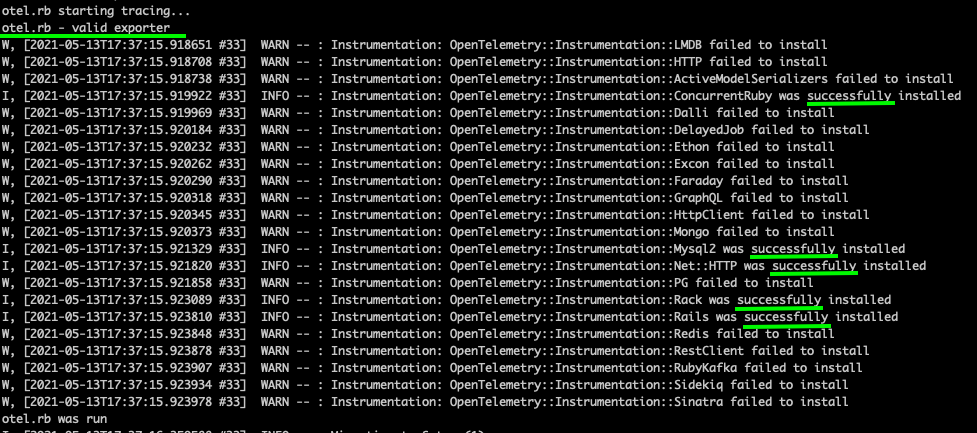

# Instrumenting an existing Ruby app with OpenTelemetry and Dynatrace

1. **First get the source of your application**. For this demo, I found an opensource app that was already containerized: [Redmine](https://github.com/docker-library/redmine)
2. **Add OpenTelemetry gems via your Dockerfile**. See [Dockerfile.add](Dockerfile.add) for commands to add to your `Dockerfile`.
3. **Add some OpenTelemetry to your code**. Above Dockerfile copies [otel.rb](otel.rb) into the source code path, so that it gets included near the top of the app. Be sure to adjust paths to your application.
4. **Enroll in Span Ingest Preview** for Dynatrace. See [Preview](https://www.dynatrace.com/support/help/whats-new/preview-and-early-adopter-releases/#expand-1216--trace-ingest-163)
5. **Add your tenant url and API token** to `otel.rb` (hardcoded) or `Dockerfile` (ENV variables).
6. **Important: front-end your app** with a OneAgent supported tech. In this demo, I'll use a simple NginX proxy_pass in front. Currently, the Preview only supports spans not root traces, so we need something else to start a PurePath. This also makes it super easy to inject RUM -- and who doesn't want RUM?
7. **Build and run your app image**. Access via your NginX proxy pass.
8. **Enable span and resource attributes** in Dynatrace. Here's some common ones:

    
    

**CAUTION**: If you are used to the data privacy protections Dynatrace and OneAgent provide, you should be aware that OpenTelemetry leaves this responsiblity to you to ensure you do not capture sensitive data.

9. **Enjoy your end-to-end PurePaths**.

## Troubleshooting
- **No spans? No errors in your docker logs?** Let's check if instrumentation was successful
    
    
    You should see not only output from `otel.rb` but also indication of which Ruby frameworks were instrumented. If you don't see these, `otel.rb` may not actually be included in your app's running code. Please check your include.
- Instrumentation is happening but **still no spans in Dynatrace?** Enable spans to console.
    
- Confirm **Span Ingest API responses**.
    
    

    - `404` - your endpoint is likely incorrect
    - `401` - your API key is likely incorrect or missing the `Ingest OpenTelemetry traces` scope
- Finally, if you are **seeing status `200`** but still not seeing spans, be sure you have a OneAgent instrumented service in front of your OpenTelemetry instrumented app.
    Currently, we do not support ingest of root traces, only extending PurePaths.